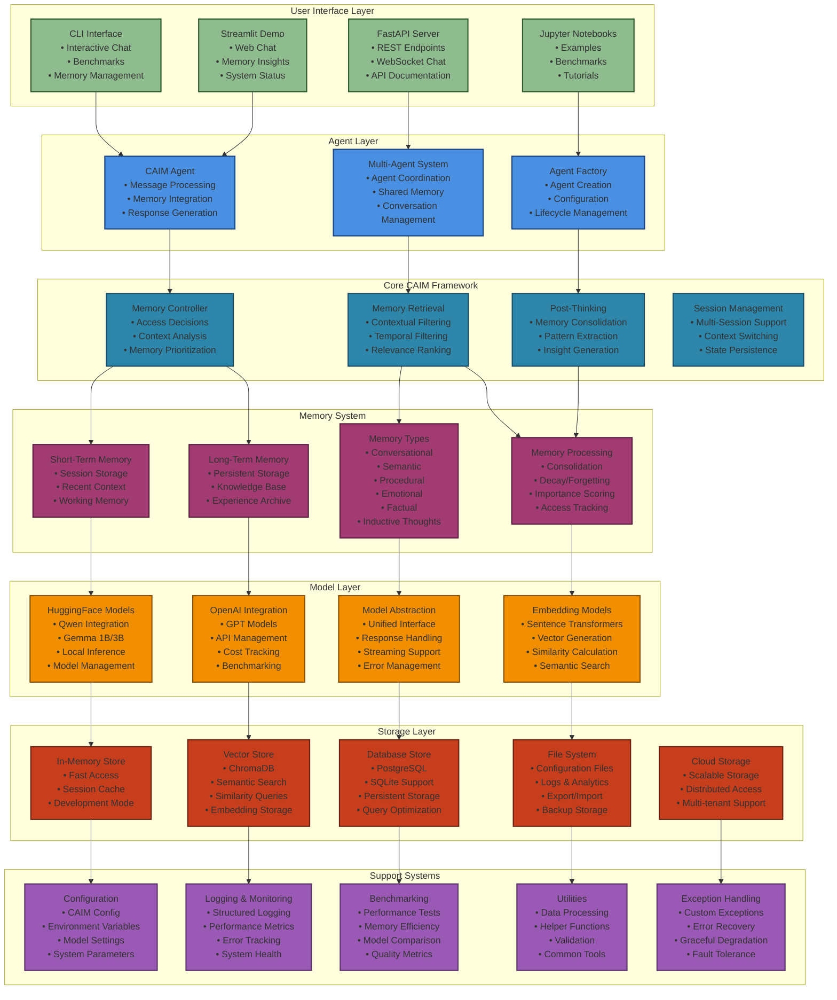
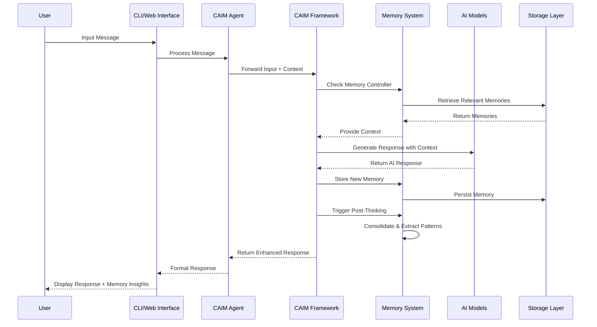
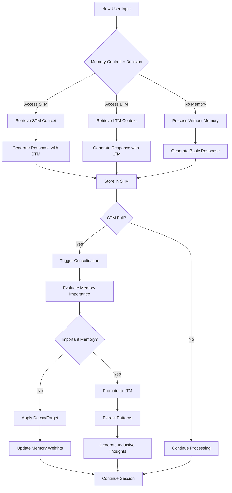
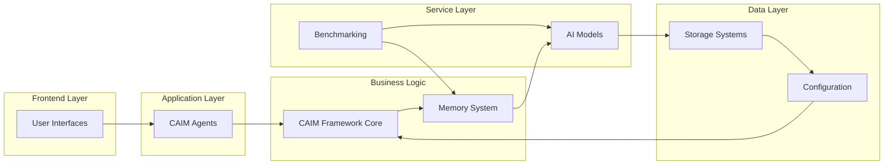
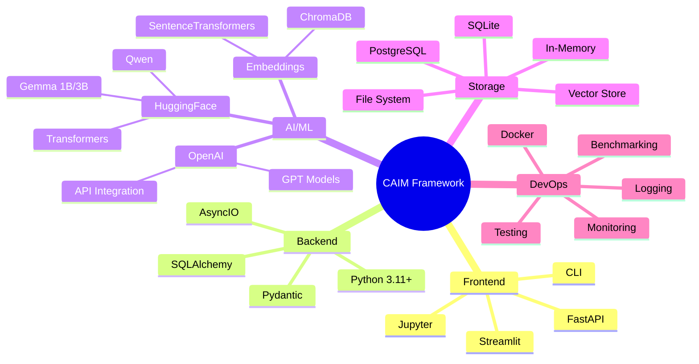

# CAIM Framework - Complete Architecture Diagram

## System Overview

## Data Flow Architecture

## Memory Consolidation Flow

## Component Integration

## Technology Stack

## Key Features Overview

- **🧠 Cognitive Memory**: Dual STM/LTM system with intelligent consolidation
- **🤖 Multi-Model Support**: HuggingFace (Qwen, Gemma) + OpenAI integration
- **💾 Flexible Storage**: In-memory, vector, database, and cloud backends
- **🔄 Async Architecture**: Production-ready with proper error handling
- **📊 Real-time Insights**: Memory visualization and performance analytics
- **🚀 Multiple Interfaces**: CLI, Web, API, and Jupyter notebook support
- **⚡ Production Ready**: Comprehensive testing, logging, and monitoring
- **🔧 Extensible**: Modular design for easy customization and scaling